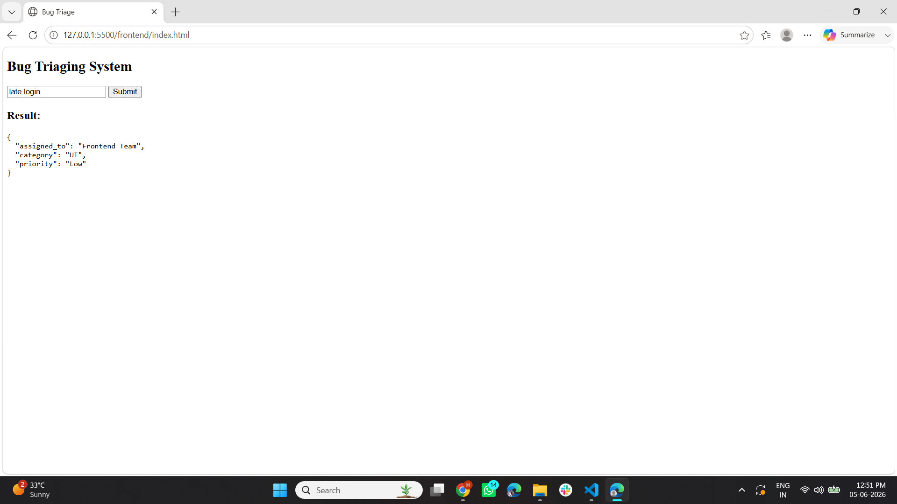

# 🏥 Triaging Agent

A smart triaging system that prioritizes tasks or requests based on urgency and importance, improving response time and decision-making efficiency.

---

## 🚀 Features
- ✅ Prioritizes tasks based on urgency
- ✅ Improves response time
- ✅ Simple and intuitive web interface
- ✅ Real-time decision making

---

## 🛠️ Technologies Used
- Python
- Flask
- HTML5
- CSS3
- JavaScript

---

## ⚙️ How to Run
1. Clone the repository
2. Install dependencies:
3. Run the app:
### Frontend
4. Go to the frontend folder
5. Open `index.html` with **Live Server** in VS Code

---

## 📸 Screenshots

---

## 📜 License
This project is licensed under the MIT License.
